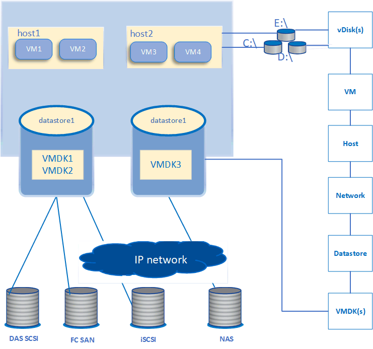

= Monitoring der virtuellen VMware Infrastruktur
:allow-uri-read: 
:icons: font
:imagesdir: ../media/

[role="lead"]
Active IQ Unified Manager bietet einen Einblick in die auf einem Datastore implementierten Virtual Machines (VMs) und ermöglicht die Überwachung und Fehlerbehebung von Storage- und Performance-Problemen in einer virtuellen Umgebung. Mithilfe dieser Funktion können Sie Latenzprobleme in Ihrer Storage-Umgebung ermitteln oder ein gemeldetes Performance-Ereignis in vCenter durchführen.

Eine typische Implementierung einer virtuellen Infrastruktur auf ONTAP setzt auf verschiedene Komponenten, die auf Computing-, Netzwerk- und Storage-Ebenen verteilt sind. Alle Performance-Einbußen bei einer VM-Applikation können aufgrund einer Kombination aus Latenzen auftreten, die bei den verschiedenen Komponenten auf den jeweiligen Ebenen auftreten. Diese Funktion eignet sich für Storage- und vCenter-Administratoren und IT-Generalisten, die ein Performance-Problem in einer virtuellen Umgebung analysieren und die Ursache des Problems verstehen müssen.

Unified Manager stellt das zugrunde liegende Untersystem einer virtuellen Umgebung in einer topologischen Übersicht vor, um zu ermitteln, ob beim Computing-Node, Netzwerk oder Storage ein Latenzproblem aufgetreten ist. Die Ansicht zeigt außerdem das spezifische Objekt, das aufgrund der Performance-Verzögerung Korrekturmaßnahmen ergreifen und das zugrunde liegende Problem lösen kann.

Die auf ONTAP Storage implementierte virtuelle Infrastruktur umfasst folgende Objekte:

* Datenspeicher: Datastores sind virtuelle Storage-Objekte, die mit den Hosts der VMs verbunden sind. Datastores sind verwaltbare Storage-Einheiten von ONTAP, beispielsweise LUNs oder Volumes, die als Repository für VM-Dateien, wie Log-Dateien, Skripte, Konfigurationsdateien und virtuelle Festplatten, verwendet werden. Sie sind über eine SAN- oder IP-Netzwerkverbindung mit den Hosts in der Umgebung verbunden. Datastores außerhalb von ONTAP, die dem vCenter zugeordnet sind, werden auf Unified Manager nicht unterstützt oder angezeigt.
* Host: Ein physisches oder virtuelles System, auf dem ESXi ausgeführt wird, die Virtualisierungssoftware von VMware, und hostet die VM.
* VCenter: Eine zentrale Managementoberfläche für das Management von VMware VMs, ESXi Hosts und allen zugehörigen Komponenten in einer virtuellen Umgebung Weitere Informationen zu vCenter finden Sie in der VMware-Dokumentation.
* Virtuelle Laufwerke: Die virtuellen Laufwerke auf dem Host, die eine Erweiterung als VMDK haben. Die Daten eines virtuellen Laufwerks werden auf der entsprechenden VMDK gespeichert.
* VM: Eine virtuelle VMware Maschine.
* VMDK: Eine virtuelle Maschine im Datenspeicher, die Speicherplatz für virtuelle Laufwerke bereitstellt. Für jedes virtuelle Laufwerk gibt es eine entsprechende VMDK.

Diese Objekte werden in einer VM-Topologieansicht dargestellt.

*VMware Virtualisierung auf ONTAP* 

*Benutzer-Workflow*

Das folgende Diagramm zeigt einen typischen Anwendungsfall der VM-Topologieansicht:

image::../media/vm-workflow.gif[vm-Workflow]

== Was nicht angesprochen wird

* Datastores, die sich außerhalb von ONTAP befinden und den vCenter Instanzen zugeordnet sind, werden in Unified Manager nicht unterstützt. Alle VMs mit virtuellen Festplatten auf diesen Datenspeichern werden ebenfalls nicht unterstützt.
* Nur NAS- und SAN-Volumes werden als Datenspeicher unterstützt, virtuelle Volumes (VVols) werden nicht unterstützt.
* In den Ansichten können Sie keine Berichte zur Analyse der Leistung der verschiedenen Komponenten erstellen

